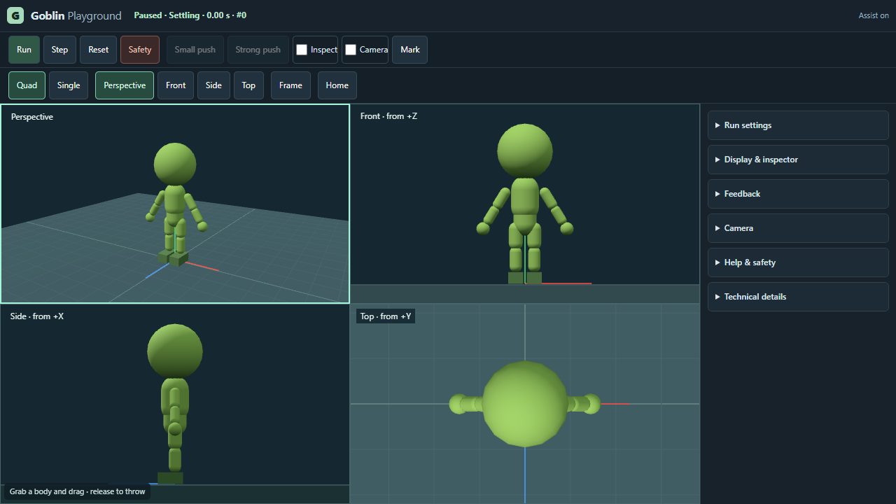
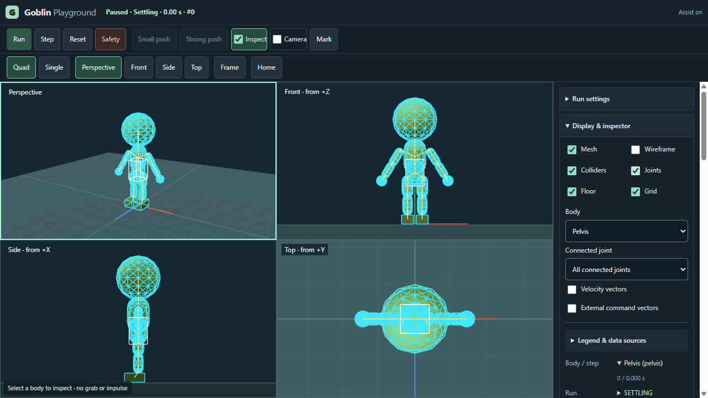
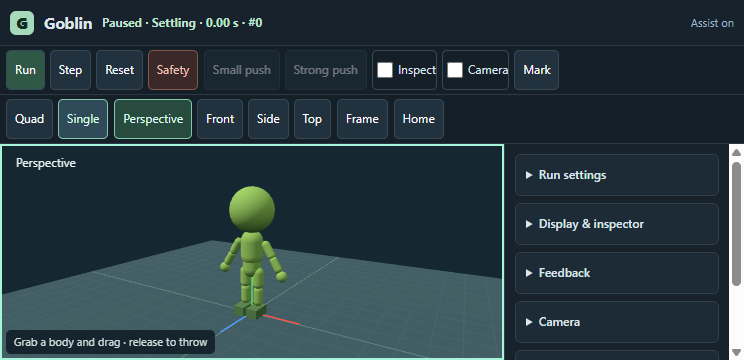
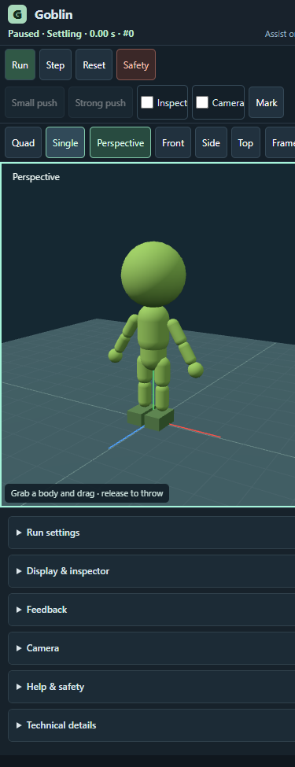

# English editor UI — Issue #113

## Bestand und Entwurf vor Umsetzung

Baseline PR114/main `ffd7807`: Playground-Stage neben einer370px-Sidebar mit dauerhaftem Buildtext, langen Hinweisen und mehrfachen Run-/Pause-/Inputmeldungen. Der Inspector wiederholte Quelle/Frame/Qualität bei jedem Zahlenfeld. Arena, Upright-Prototyp und Vergleichsviewer enthielten deutsche UI-Texte. Standing war bereits Englisch. Der konkrete Entwurf und seine Abnahme wurden vor Runtime-Umbau in #113 dokumentiert.

Neue Hierarchie: schlanke Kopfzeile mit einem Run/Pause/Safetyzustand und Assistindikator; externe Transport-/Interaktionsleiste; kompakte Kameraleiste; zentrale Stage mit280px-Dock. Run settings, Display & inspector, Feedback, Camera, Help & safety und Technical details sind einklappbar. Häufige Run/Step/Reset/Safety- und Kameraaktionen hängen nicht vom Sidebar-Scroll ab. Inspect öffnet den Inspector; Mark öffnet Feedback. Der Inspector zeigt kurze Werte; Herkunft, Frame, Qualität und Einschränkungen stehen pro Feld aufklappbar. DOM-Zellen bleiben bei Live-Updates bestehen, damit Disclosure und Tastaturfokus erhalten bleiben.

Tooltips ergänzen kurze englische Labels; aufklappbare Hilfe stellt dieselben Informationen auf Touch bereit. Keine neuen globalen Shortcuts überschreiben Texteingabe oder die bestehenden Escape-/Safety-/Griffverträge. Portrait ordnet die Kamera oberhalb der Panels an; Querformat behält eine separat scrollbare Sidebar. Toolbaroverflow ist lokal horizontal scrollbar, keine horizontale Seitenverschiebung. Safety bleibt in der festen Transportgruppe.

## Abnahme und Nachweise

- Desktop1280×720,744×360 Querformat,390×844 Portrait: zentrale Kamera, Controls erreichbar, Safety sichtbar, kein horizontales Seitenoverflow. Quad und Single erhalten.
- Kameraerhaltung, echte Viewport-Picks, Maus-/Touchgriff, Camera/Inspect-Ausschluss, Overlays, Pause/Step/Reset, Assist-off/Safety, Speed/Timer, Marker/echter JSON-Download bleiben im bisherigen gemeinsamen Pfad.
- Englische HTML-/DOM-/Tool-/ARIA-/Status-/Fehlertexte in Arena/Playground, Upright und Vergleichsviewer. Historische Rohdaten und aufgezeichnete Clips sowie Nutzertexte werden nicht umgeschrieben; sie sind Daten, keine App-Labels.
- Gezielt: `tests/playground-browser.cjs --issue113 --issue102 --issue101 --issue99 --skip-long-run`; Arena mit `GOBLIN_UI113=1` und bestätigtem Chrome. Der UI-Modus prüft bestehende Tools, Ziele/Score, Round-end/Retry, Hilfe/Freeze, Reset/Ressourcen und Touch; er erneuert keine G2-Physik-Stabilitätsabnahme.
- Ein zusätzlich gestarteter historischer G2-Dragbenchmark scheiterte an `lowerArmR representative angular stability`. Keine positive G2-Abnahme daraus ableiten; keine Physik-/Rig-/Gains-/Clampänderung oder Schwellenlockerung in diesem UI-Paket. Die spezifikationsbezogenen UI-Prüfungen werden separat abgeschlossen. Native Hidden/Resume, Mobilhardware und GPUperformance bleiben nur mit echten Nachweisen abnehmbar.

Finale Head-/Buildidentität, Rohbelege, Tests/CI und Release sind in #113/#88/PR verlinkt. Kein neues Forschungsprogramm und keine Umsetzung von #98/#103.

## Finales Layout

Reviewkorrekturen: Die sichtbaren Zeit-/Stepzahlen liegen außerhalb der Live-Region; nur geänderte Run-/Safetyphasen werden angekündigt. Der historische #79-Ledger enthält auch Arena-UI und Browserfixture. Deren ursprüngliche Bytes sind nun bytegenau unter `frozen-inputs` gesichert; bestehende historische Hashes bleiben unverändert. Explizite aktuelle Review-Pins akzeptieren ausschließlich die geprüfte #113-UI/QA-Version, einschließlich Mutationstests. Dies ist Archivkompatibilität, keine neue Physik- oder Standing-Abnahme.

Screenshot-Satz: native Chrome156.0.8078.4, eigener temporärer Playwright-Profile, Build `a3af22bd8e66c2db`, identische finale UI-Quelldateien in allen vier Bildern; Desktop1280×720, Landscape744×360, Portrait390×844 (Scrollbar reduziert die Inhaltsbreite). Letzter visueller Fix: Grid-/Status-Minimum und nicht schrumpfender Assistindikator verhindern dessen Abschneiden neben der Portrait-Scrollbar. Der Browsercheck prüft nun ausdrücklich dessen rechte Grenze.

