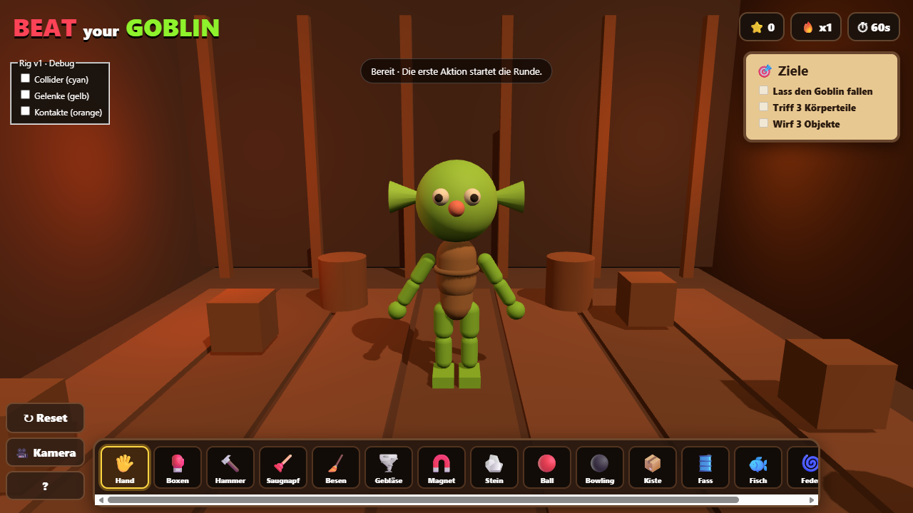
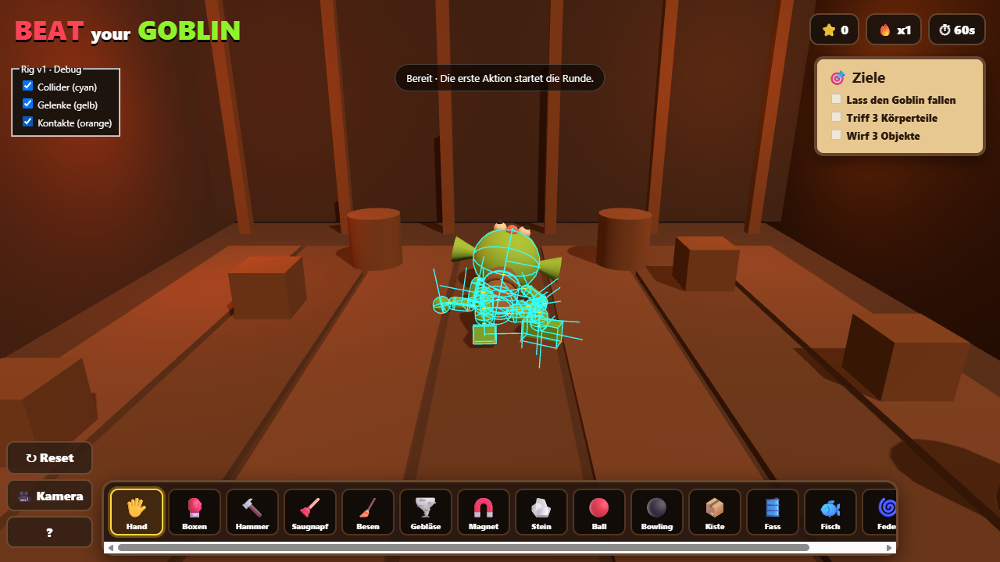

# G1 review / evidence

Historical initial G1 report (published head `006f33b`). The independent PR #27 re-review found reset/picking and debug teardown defects missed here; its findings, fixes and stronger evidence supersede the initial success statements below. See [review follow-up](g1-review-followup.md). Original measurements and captures remain historical evidence.

Fixed base: `15733beddcdcfbbb2f8414ea415c22e2abeac115` (main, G0 portrait merge). Scope: Issue #13 / Masterplan #11 G1 only. PR/commit and CI links are recorded in Issue #13.

## Spec

No outstanding blocking findings in the implemented G1 scope. Fifteen parts have independent bodies/colliders, named joints and bone contracts; hands/feet are independent. Chibi proportions, mass/COM, limits, self contacts, transform ownership and face/animation boundaries are documented in [rig contract](goblin-rig-contract.md). No GLB, standing/recovery, new tools or engine/version change.

CCD remains off because tested fast floor contacts did not tunnel, including the comparison with CCD enabled. This evidence is restricted to the listed speeds/shapes/scenario; it does not cover every possible thin moving collision.

## Engineering

No remaining blocking findings after local review. Corrected during review/QA: debug controls overlapped the objectives panel; reset now calls the same rig reset implementation used by physics regression tests; quaternion-error diagnostics normalize both operands to avoid float normalization artifacts.

Checked: direct map lookup for picking, adjacent-only contact filtering, matching bind anchors, same shape specification for physics/meshes, bounded debug buffers/contact enumeration, geometry/material disposal on debug disable, persistent reset state and projectile cleanup. Rapier 0.21 and Three 0.186.1 installed APIs were checked; dependencies/lockfile/CI were not upgraded. Known preexisting bundle-size warning remains (~4.895 MB JS, 1.812 MB gzip).

## Tests and measured behaviour

- Node 24.21.0 via fnm: 12/12 tests, build, `git diff --check` pass. Direct and glancing 10m/s projectiles produce real head contact manifolds.
- Physics: 12 deterministic drop/impulse cycles × 900 fixed steps. Max joint-anchor gap .06399 m, max speed 8.9153 m/s; final 1s of each 15s run had zero speed. Six additional hammer-strength (6.2 Ns, off-centre) + 10m/s projectile cases × 1200 steps: max gap .04528 m, final second zero speed. Body translations finite and above floor bounds. Teardown removes all rig bodies/colliders/joints/maps.
- Windows hardware Edge 154.0.4258.53, ANGLE/NVIDIA RTX 3070 Ti/D3D11, Ryzen 5 5600X. Existing MCP session and unchanged dev server 5174; own production preview on 4174. Automated production smoke serves the real `/goblin/` prefix, verifies 60.05s idle, all 15 distinct picking IDs, pointer cancellation, pause/focus-event paths, projectiles cap, repeated resets, debug disposal and portrait/landscape touch emulation. No new page errors, console warnings/errors or failed production requests.
- MCP production: real mouse grab/drag/release, full 60s round ends with score 600, retry/reset; all 3 cameras; visual/body position error zero. Separate debug check shows 20 solver contact points; 20 enable/disable/reset cycles return to 47 geometries/3 textures/0 debug resources.
- Performance, comparable G0 conditions: foreground 1280×720, renderer DPR1, hardware Edge/GPU above, overlays off, reset +2.2s settle, 30 head-targeted Ball clicks, 24 projectiles, 1800 rAF intervals, sorted median index900 / P95 index1710. All samples active. Final duration10.9228s, median6.1ms, P956.2ms, max6.2ms, max frame CPU1.7ms, max physics.5ms, at most1 step. G0 median6.1/P956.2, max physics.4ms: unchanged frame quantiles, +.1ms observed max physics. This is desktop evidence, not a low-end/mobile GPU guarantee.
- CPU8 simulation: first full-diagnostics G1 run median12.2/P9518.3ms, max physics5ms; freshly rebuilt G0 with the same probe also median12.2/P9518.3ms, max physics6.8ms. Historical G0 CPU8 P9512.2ms is not reproduced by that fresh instrumented run. A second A/B probe samples only rAF intervals (diagnostics once at end; explicitly different instrumentation): G0 median12.1/P9512.3ms over19.9766s; initial G1 median12.1/P9518.2ms over20.9901s. After reducing small hand sphere tessellation from24×18 to12×8, final G1 median12.1/P9512.3ms over20.5592s, max24.2ms. All1800 intervals, same1280×720/DPR1, 30 clicks,24 projectiles, foreground GPU. CPU throttle restored to1 afterward. These measurements meet the documented simulated30FPS budget; they are not real weak-device acceptance or proof of improvement in every workload.
- Budget now 26 total bodies/14 joints, maximum50 with 24 projectiles; G0 22/10/max46. +4 bodies/+4 joints provide separate hands/feet. Final stress render124 calls/29288 triangles versus G0 approximately115/28504. Geometry47 versus43. No unbounded growth.

## Limits

Touch emulation is not real Android acceptance. Existing G0 real-device and native-hidden/visibility limitations remain unchanged. Future GLB bone offsets/skin deformation and expressions are contracts, not tested assets. No deployment/merge is performed for this draft. Vite preview is mounted at `/`; attempting `/goblin/` directly there produced an expected missing nested asset, so the successful prefix test uses the dedicated production smoke server instead. No game defect was inferred from that preview mounting mismatch.

Reviewed camera, bind-pose, contact-overlay and stress captures are under `.playwright-mcp/g1-*.png`. Final bind/contact screenshots are included under `g1-evidence/`; other captures remain local QA artifacts. The PR/issue describe exact reproduction, results and limits.

