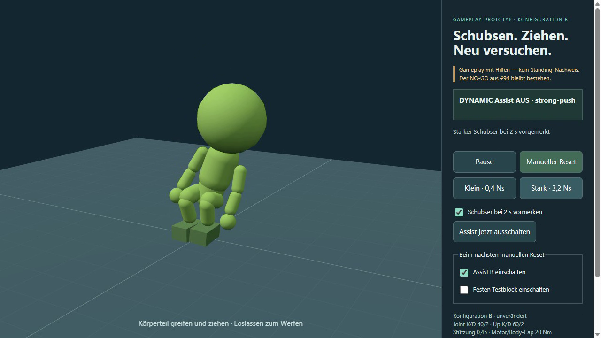

# V2 — lesender Referenzvergleich, abgeschlossen (09.10.2026)

**Beobachter geliefert; kein Gameplay-Pass.** [Prüfvertrag V2](https://github.com/bongohorse/goblin/issues/94#issuecomment-6072689640), [Zählung vor Laufstart](https://github.com/bongohorse/goblin/issues/94#issuecomment-6072753264).
B, Assist-/Physik-/Eingabeparameter und alle historischen 2°-FAILs bleiben unverändert. Y1/Y2 sind keine Defaults. PR #95 bleibt Draft.

## Q — quantitative Messung

Genau **4/4 native Sequenzen à6 Simulationssekunden**, erster Start erfolgreich:
R1 ohne Input → P1 mit Originalkleinimpuls → R2 ohne Input → P2 mit Originalkleinimpuls.
Ein Paar zählt zwei Sequenzen; keine Zusatz-CLI-Diagnose oder Ersatzläufe.
Beide Paare besitzen vollständige Steps0–360, identische gesamte Vorzustands-/Körper-/Commandtraces bis Step120 und dieselbe Konfigurations-/Quellen-/Kameraidentität. Beide Eingabeantworten sind stepweise identisch.

Quelle: **4ad37a6dec91317f59738e25f18fc3ecb4b21d9e**. Derselbe vorhandene
`UprightSession.tick → UprightSlice.step → world.step`-Pfad, dt1/60;
Rapier-Getter liefert die entsprechende Float32-Zahl0,01666666753590107.
Der Recorder liest fünf Body-Ursprünge, alle15 Körper inklusive Schlafzuständen,
Assist-/Timer-/Grabzustand und native Geschwindigkeiten vor/nach Input.
Keine weitere World oder Controllerimplementierung im Vergleich.

Original0,4N·s in Welt+X beiStep120, Torso-Lokalpunkt(0;0,30;0);
tatsächlicher Weltpunkt(−0,01050536;1,76736735;−0,00730463)m.
Unmittelbar Δvₓ0,200000008m/s, Δωz−1,249042530rad/s.
Gerichtete Unterschiede **P minus zeitgleiches R**, d=+X, c=−Z:

| Body-Ursprung | größter positiver Δd2–4s | kleinster Δd2–4s |
|---|---:|---:|
| Kopf | +8,711mm (Step130) | −18,408mm (211) |
| Torso | +5,448mm (131) | −17,490mm (214) |
| Becken | +4,131mm (131) | −17,318mm (219) |
| Fuß L | +0,270mm (124) | −28,437mm (240) |
| Fuß R | +3,514mm (240) | −4,277mm (190) |

Torso Δβ in Schubebene maximal **+0,24011°** beiStep129, danach
−0,15690° bei153. Orthogonale Δγ etwa−0,06669…+0,04390°.
Up-Vektordifferenz maximal0,24011°. Relative Kopf-/Torso-Becken-/Fußbasisbewegung,
Bildprojektion, komplette Winkel-/Geschwindigkeitsverläufe und Fensterwerte im Rohbeleg.

Torso-Geschwindigkeitsdifferenz RMS: Antwort2–4s0,02932m/s,
letzte halbe Antwortsekunde0,00824m/s, Nachfenster4–6s0,00547m/s.
Restversatz am Ende etwa−8,080mm am Torso. Die Füße bewegen sich asymmetrisch weiter:
FußL am Ende−39,808mm, FußR ungefähr+19,828mm gegenüber R.
Dies ist kein vollständiger Stillstands-/Abklingnachweis.

**Legacy V1 getrennt:** Beide Paare0,4424263024° zusätzliche absolute
Torso-Neigung → **FAIL gegen unveränderte2°**. Keine neue Amplitudenschwelle.
Stored-Test bestätigt die vollständige Torso-Pose-/Velocity-/Up-Trajektorie
Steps0–360 exakt gegenüber dem ursprünglichen nativen B-Schubserbeleg.

[Rohbeleg mit getrennten Q/H/S, gzip](gameplay-upright-v2-evidence.json.gz).
SHA256 gzip:`cc8c77ebee4d03eab8bd421bcd69af66834f57965d14a0d2916d34cc3cd2e3a0`.
Unannotiertes originales lokales JSON SHA256:
`7a01a8b475ceb89efea19c2f8f6b2a739be1ca593f7cc0ca1c6a6b646de1b658`.
Die spätere H-Annotation verändert keine Messwerte; das Original liegt lokal in
`browser-observation-v2-20261009/results.json`, zusammen mit Budget/Clips.

## H — Sichtbarkeit separat

Agentenbewertung aus nativer1×-Eingabeclipwiedergabe bei Original1280×720/DPR1
und Reaktionsframes, anschließend R/P über die sichtbare HUD-Zeit verglichen:
1. **Nein:** weiterhin nur schwaches kurzes Versetzen, kein klar lesbarer kleiner Treffer.
2. **Unklar:** Richtung ist messbar; die schwache Bildbewegung lässt sich nicht überzeugend
   als eigene gerichtete Reaktion vom Leerlauf unterscheiden.
3. **Unklar:** Oberkörper bleibt unterstützt aufrecht und ruhig; fortgesetzte Fußbewegung
   begrenzt die Aussage zum vollständig kontrollierten Abklingen.

Keine Nutzerabnahme, Spaßscore oder aus Diagramm/Zoom abgeleitete Sichtbarkeit.
Paar2 ist quantitativ identisch, aber nicht als separate menschliche Abnahme gewertet.

[ReferenzR1](gameplay-upright-media/v2-1.webm) ·
[EingabeP1](gameplay-upright-media/v2-2.webm) ·
[ReferenzR2](gameplay-upright-media/v2-3.webm) ·
[EingabeP2](gameplay-upright-media/v2-4.webm).

Die nativen Clips enthalten Lade-/Bedienvorlauf; gleiche Video-Wallclock ist
nicht automatisch gleiche Simulationszeit. Beide Clips über HUD-t ausrichten.
Die mathematischen Vergleiche sind dagegen exakt stepgleich.
Die verkleinerten nebeneinander angezeigten Clips dienen dem Vergleich,
ersetzen nicht die Bewertung des Eingabeclips im normalen Bildmaßstab.

## S — Sicherheit separat

Alle vier bleiben vor der Endpause `ASSISTED_READY`, kein Fall/Balance-lost,
kein invalid oder Nicht-Fuß-Bodenkontakt; maxJointankerlücke0,00530m.
Beide Eingabeläufe erfüllen beiτ=2s den bisherigen aufrechten Bereich mit
Becken-/Torso≤15°, Beckenhöhe0,95–1,25m und Fußnähe/Berührung.
Native Commandcaps bleiben im bestehenden Rahmen.
Die Fensterpause schaltet anschließend wie bisher die Hilfen aus;
Endpause ist kein früher Assistverlust.

Kein neuer Griff-/Stark-/Block-/Assist-Aus-/Reset-Verhaltensnachweis,
keine solverinterne Motorimpulsmessung, vollständige Durchdringungsabnahme,
15s-Haltung, Hidden/Resume, Touch/Mobilhardware, Standing- oder Performancefreigabe.
Diese bisherigen Anforderungen/Prüflücken bleiben erhalten.

## Bedingungen, Checks und Selbstreview

Windows11/win32 10.0.26300 x64, Node24.21.0, native ChromePortable156.0.8078.4,
isoliertes Profil `5ba362d2ac316fc0613e21c146a9c1ae93e934243509699da469f11b01412c7b`.
Executable SHA256 `ea4eb4ea31e82309db8b8b9dcdd445f2ed997d09f96f95f7d78db26ed39be249`.
1280×720/DPR1, Canvas940×720; unveränderte Kamera(3,8;2,7;6), FOV36°,
Look-at(0,35;1,05;0). Ryzen5 5600X, RTX3070Ti ANGLE/Direct3D11/WebGL2.
Bereinigte Launchargumente im Rohbeleg; keine Background-Throttling-Disableflags.
Keine allgemeine Hardware-/Frameratebehauptung.

- **120/120 Repositorytests**, null übersprungen; gezielte Zuordnung-/Vorzeichen-/
  Step-/Missing-data-/Read-only-/Stored-Checks ohne neue Diagnosekampagne.
- Produktions- und isolierter Gameplaybuild erfolgreich; reguläre finale Head-CI
  wird im PR/Issue unter ihrer tatsächlichen Headidentität verlinkt.
- Native Vergleichsansicht: Rohdaten laden, Paarwechsel, Stepanzeige und seekbare
  Clipwiedergabe geprüft; keine Consolefehler/-warnungen. Vergleichsansicht enthält
  weder World noch laufende Simulation.
- Vollständiger Diff als **Selbstreview**, kein unabhängiger Review.
  Assistcontroller, Rig, Grab, FixedClock, Produktionsarena, normale Vitekonfiguration,
  Lock und Forschungsdateien bytegleich. Bestehende historical Reports/Archive erhalten.
  Nur Recorder/Auswertung, feste6s-Beobachtungsgrenze, reine Vergleichsansicht,
  Aufnahmeverdrahtung, Tests und Belege. Kamera-/Renderparameter unverändert.
  Nach der Messung nur Clipseek und fehlende/null Reader-Datensätze abgesichert;
  kein Recorder-/Physikpfad geändert, Stored-Vergleich bleibt identisch.

## Lokaler Testzugang

**Ohne neue Physik:** http://127.0.0.1:4174/goblin/gameplay/upright/comparison.html
Paar1/2 wählen → Q/Legacy/S lesen → Messstep bewegen →
Clips über HUD-t ausrichten und bei1× abspielen.
Clippositionen sind Videowiedergabe, keine Parameterregler.

**Eigener Spieltest, pausierter Start:** http://127.0.0.1:4174/goblin/gameplay/upright/?yield=B&observe=v2
Start → Klein bei2s vormerken → sechs Sekunden → manueller Reset.
Eigene Nutzerinteraktion ist keine bereits erfolgte Abnahme.
**Agentenbudget4/4 beendet; Runner nicht erneut starten.**

Falls Preview fehlt, im PR-Worktree:
`npx vite build --config vite.gameplay.config.js`, dann
`node scripts/gameplay-upright-preview.cjs`.
Strikter4174, keinen fremden Server übernehmen. Der Build enthält die
gespeicherten Rohdaten/Clips für die Vergleichsansicht; normale Arena bleibt separat.

## Umgebungsfehler und begrenzte Maßnahmen

Normaler Prozesshelper scheiterte vor Start(`helper_unknown_error / setup refresh`);
vorhandener Node-Zugang und gezielt genehmigte Fetch-/Git-/Test-/Browserprozesse erfolgreich.
Stepfreier Wasmcheck im REPL scheiterte an dessen Embeddergrenze; derselbe
API-Read ohne world.step im vorhandenen Node-Kindprozess erfolgreich.
Keine globale Konfiguration/Installation oder Fremdprozesse verändert.
Diese zwei lokalen Ersatzmaßnahmen waren jeweils unmittelbar begrenzt;
Helperursache bleibt offen, keine notwendige Laufprüfung dadurch blockiert.

DevTools-Dateiscreenshot verweigerte den angegebenen Workspacepfad;
keine Pfad-/Berechtigungsreparatur, nur reguläre Inline-Screenshotausgabe benutzt.
Native Runner-Screenshots liegen bereits im lokalen Belegordner.
Der vorhandene Previewserver unterstützt keine Byte-Ranges:
erster Clipseek landete bei0s. In-scope die reine Ansicht auf Blobwiedergabe
mit URL-Revoke bei Paarwechsel/Teardown geändert; Seek anschließend erfolgreich.
Kein Serverneustart, keine neue Simulation. PowerShell-Testlog ist UTF16;
korrekt decodiert, kein Test wiederholt oder Ergebnis verloren.

## Genau ein nächster Schritt — Empfehlung, nicht freigegeben

**Ein separat begrenzter Versuch mit einem kurzzeitig in Schubrichtung
verschobenen Aufrichtziel für den gekoppelten Oberkörper.**
Begründung: Der Impuls wirkt und erzeugt eine kleine gerichtete Antwort,
aber steife Haltung/gekoppeltes Rig machen daraus kein klares Feedback.
Ein ausdrücklich gekennzeichnetes ereignisabhängiges Poseziel könnte die
bestehenden zulässigen Bewegungen des gesamten Rigs nutzen, statt nur die
unveränderte Zielaufrichtung passiv schwächer zu machen.

Das wäre ein anderer begrenzter Gameplay-Assistmechanismus, keine hier
belegte Fehlerkorrektur oder Erfolgszusage. Vor Freigabe wären Zielverlauf,
Caps und Griff-/Hit-/Fall-/Reset-Unterbrechung festzulegen.
Keine Gainsuche, stärkere Originaleingabe, Rigänderung oder weitere
Vertragsrevision wird dadurch aktiviert. **Hier nicht implementiert/gestartet.**

**PR bleibt Draft. Kein Merge/Deployment/Recovery/Folgepaket. STOPP.**

---

# Nachgabeversuch — 09.10.2026: kein ausreichender Nutzen, STOPP

[Vorabplan](https://github.com/bongohorse/goblin/issues/94#issuecomment-6072289713), PR #95 bleibt Draft. Vorher war die kleine B-Reaktion schwach; jetzt sind zwei eng begrenzte Torque-Nachgabevarianten implementiert und verglichen. **Keine Variante erfüllt das unveränderte 2°-Kriterium oder den vorab festgelegten Diagnose-Mehrnutzen. Alte FAILs bleiben bestehen.**

## Hypothese und kleinster Eingriff

Globale Up-Torques könnten die kleine Inputantwort begrenzen. Nur die bereits auf20Nm begrenzten Torquevektoren für pelvis/torso werden zeitweise skaliert, einschließlich Tilt-Dämpfung. Keine zusätzliche Kraft. B-Gains, vertikale Stützung, Gelenkmotoren/Caps, Poseziele, Solver, Rig, dt und0,4/3,2Ns-Schubser unverändert. Default ist weiter B.

Kleiner Impuls im ASSISTED_READY und aktivem Assist beginnt das Fenster vor dem folgenden Step. B:Faktor1; Y1:0 für12Steps(0,20s), linear0→1 über18Steps(0,30s); Y2:0 für24Steps(0,40s), linear0→1 über24Steps(0,40s). Wiederholter kleiner Impuls verlängert ein laufendes Fenster nicht. Der erste Ramp-Step beginnt bei0; voller Faktor wird im ersten Step nach30/48 abgelaufenen Schritten wieder angewendet. Simulationszeit1/60s, keine Wallclock-Timer.

Interrupt/Griff/Stark/Assist AUS/Balanceverlust/Pause/Sicherheit/Reset/Dispose löschen das Fenster. Der Timer setzt enabled niemals auftrue. Reset startet ohne Altfenster pausiert. UI zeigt feste URL-Variante und FULL/YIELD/RESTORE/OFF samt Faktor; keine Parameterregler. Trace commands.upFactor ist der tatsächlich im aufgezeichneten Step angewandte Faktor, upAssist beschreibt den Zustand am Stepende/für den nächsten Step.

## Fixierter Vergleich / Budget

**3/8 Diagnoseversuche verbraucht**, jeweils10s native Simulation. B,Y1,Y2 jeweils kleiner Originalimpuls vorStep121 bei2s; genau eine Wiederholung je Variante, keine neuen Varianten, keine Wiederholung bis Pass. Vor-Input-Torso/Becken und Befehle bisStep120 numerisch identisch; Metadaten unterscheiden nur das Profil. Die neue B-Referenz reproduziert den alten0,44243°-FAIL.

| Variante | Zusätzliche Torso-Up-Neigung2–4s | Mehr als B | Altes≥2° | Torso bei4s | Rückkehr |
|---|---:|---:|---|---:|---|
| B |0,44243°|—|FAIL|0,21951°|aufrecht|
| Y1 |0,50151°|0,05908°|FAIL|0,13742°|aufrecht|
| Y2 |0,73520°|0,29277°|FAIL|0,03988°|aufrecht|

Messung: Maximum der Step-Endwerte121–240 minus Vorwert beiStep120 (alle0,06210°). Keine Senkung/Umdeutung der2°. Rückkehrbedingung der Diagnose: ab4s bis10s Becken/Torso≤15°, Beckenhöhe0,95–1,25m, keine Nicht-Fuß-Bodenauflage, Assist aktiv. Alle drei erfüllen diese begrenzte Rückkehr; maximaler Ankerabstand0,00530m, keine invalid-Zustände. Volle Up-Hilfe inY1 abStep151, Y2 ab169. Kein15s-/Last-/Standing-Nachweis.

Keines der beiden Profile erreicht den **vorab** festgelegten Mehrnutzen≥0,5° gegenüber B. Deshalb planmäßig STOPP nach3, fünf mögliche Versuche **nicht** verwendet. Kein nachträgliches Tuning. Sequenzen4–8 (Wiederholung, klein→stark, klein→Handgriff, klein→Assist AUS, klein→Pause/Reset) wurden nicht begonnen. Deren dynamische/native Kriterien bleiben für die Nachgabevarianten offen.

## Sichtbare Reaktion — getrennt von Messdaten

Native Videoaufnahmen und daraus extrahierte Reaktionsframes gesichtet. Der Körper bleibt in allen Blicken nahezu aufrecht; Bewegung klein, kein überzeugend klarer Schwankmoment. Die gespeicherten Statusbilder zeigen YIELD0%, RESTORE und FULL passend zur Reaktionsphase. Numerische Verbesserung vonY2 ist **kein** bestätigter sichtbarer Gameplay-Erfolg. Keine menschliche Nutzerabnahme/Spaßwertung oder vollständige Video-/Bewegungswahrnehmungsstudie.

[Native B-Aufnahme](gameplay-upright-media/yield-B.webm), [Y1](gameplay-upright-media/yield-Y1.webm), [Y2](gameplay-upright-media/yield-Y2.webm). Alle Originalvideos, Screenshots und Rohdaten lokal unter browser-observation-yield-20261009, keine neue Simulation zum Lesen nötig.

[Unveränderte Rohdaten gzip](gameplay-upright-yield-evidence.json.gz), entpackt SHA256 c128fb223005707d386aa3536dfc64d8f1b11780e6a04d41c074bab4c6555fad. Beobachtungshead083ff02e4a78f33181b41385aa4976efefc7164b, Controllerhash f97da8547dd4b5fbdcf9360fba3498897cfec29aa1932317a8c1fe79820cd736. Nach Beobachtung nur Bericht/Belege ergänzt, kein weiterer Runtimeeingriff oder dynamischer Lauf.

## Tests, Grenzen und Umgebungsdiagnose

Drei gezielte neue Tests **ohne world.step** prüfen: feste Zeitprofile und begrenzte Skalierung bei unveränderten anderen Befehlen; Unterbrechung/Griff/Stark/Off/Down ohne Altreaktivierung; Pause/Reset und identische Spawn-/Nullvelocities. Reale native Setter werden benutzt, der Stepzähler ist eine Unit-Fixture. Ein anfänglicher Fixturefehler (Impuls verändert Winkelgeschwindigkeit auch ohne Step) durch Fixieren dieser Command-Fixture korrigiert; keine zusätzliche Verhaltenssimulation. Historischer Controllerhash bleibt im Archiv, Live-Hash-Freeze des nun ausdrücklich zur Änderung freigegebenen Gameplaycontrollers ersetzt; Forschungspins unverändert.

**115/115 reguläre Tests bestanden,0 übersprungen; normaler Produktionsbuild und isolierter Gameplaybuild erfolgreich.** Bestehende Repository-Regressionen keine neue Assistkampagne. Finale Head-CI und Commit im PR/Issue. Keine Consolefehler/-warnungen oder HTTP-Fehler in den drei nativen Sequenzen. Selbstreview des vollständigen PR-Diffs sowie Nachgabediffs; Produktionsarena, Standing-Verträge, Rig/Grab/Runtime, normale Vitekonfiguration, Lock/Dependencies unverändert. Rapier bleibt dynamischer Transform-/Velocityowner.

Native Windows11 win32 10.0.26300 x64, Node24.21.0, Chrome Portable156.0.8078.4 headful mit eigenem temporären Profil; Ryzen5 5600X, RTX3070Ti ANGLE/D3D11 WebGL2,1280×720/DPR1. Native Executable- und Profilhash sowie komplette bereinigte Startargumente in Rohdaten. Background-Throttling-Disableflags entfernt; Automationsflags no-sandbox/enable-unsafe-swiftshader dokumentiert, tatsächlicher Renderer NVIDIA. Keine Hardwarefreigabe. Nur deskriptive Frame-P95 B/Y1/Y2:12,2/12,2/18,2ms mit Video/Observer, kein dediziertes CPU-/GPU-Performanceexperiment.

- Normales exec_command erneut helper_unknown_error/setup refresh vor Start. Node und gezielt freigegebene Shellaktionen funktionieren; Ursache normaler Prozessanbindung bleibt offen. Keine globale Reparatur.
- Chrome-DevTools-Smoketest und gezielte native Prozessidentität erfolgreich; vorhandener Videoencoder wiederverwendet. Native Diagnose startete beim ersten Versuch, **0 Browserreparaturen/0 zusätzliche Starts**. Keine fremden Browser/Server beendet.
- Ein Node-REPL-Aufruf mit den vollen Tests überschritt30s und verlor seinen Ergebnisstatus; Kernel zurückgesetzt. Gezielt geprüft: kein entsprechender Test-/Buildprozess mehr aktiv. Tests einmal mit dauerhaft erhaltener Shellausgabe wiederholt, nach33,35s115/115 bestanden; Build ebenfalls einmal mit erhaltenem Ergebnis bestätigt. Kein Browser-/Assistversuch wiederholt.
- Stark/Hand/Off/Reset-Verhalten während Nachgabe nur API-/Unitgeprüft, **kein neuer dynamischer oder nativer Nachweis** nach dem Nutzengate. Historische B-Browserbefunde gelten nur für damaliges B. Hidden/Resume, Touch/Mobilhardware, Wurf und weitere ursprüngliche #94-Grenzen unverändert offen.

## Lokaler eigener Test / Entscheidung

Server4174 bereitgestellt: http://127.0.0.1:4174/goblin/gameplay/upright/?yield=B (unverändertes B-Verhalten), ?yield=Y1 oder ?yield=Y2 für die beiden festen Nachgabevarianten. URL neu laden startet pausiert. Start → kleiner Schubser, optional bei2s vormerken → Up-Phase beobachten → manueller Reset. Stark/Hand/Assist AUS bleiben zugänglich, sind für diese neue Nachgabephase nicht nativ abgenommen. Reset stellt dasselbe URL-Profil her, ohne Altfenster. Kein Defaultwechsel auf einen FAIL-Kandidaten.

Neustartbefehle im historischen Abschnitt unten gelten weiter; Diagnosemodus heißt --run-approved-yield. **Nicht erneut durch den Agenten starten: fachlicher Stop bindet trotz3/8.**

**Empfehlung: diese zwei Nachgabevarianten als Lösung für die kleine Reaktion verwerfen.** Der begrenzte Eingriff hat numerisch geringen Effekt und keinen ausreichenden Nutzennachweis. Das widerlegt nicht jede Assistarchitektur. Ein einzelner möglicher nächster Entscheidungshebel wäre eine separat begrenzte Prüfung der relativen Posemotor-Gegenhaltung statt weiterer Up-Timerverlängerung; reine Hypothese, hier nicht untersucht/freigegeben/implementiert. Keine Aufstehfunktion oder nächste Phase.

**PR bleibt Draft, #94 bleibt offen/NO-GO. Kein Merge/Deployment. STOPP.**

---

## Historische Browserphase08.10.2026 (unverändert)

# Gameplay B — lokaler Browser-Prototyp, weiterhin kein #94-Pass

Freigegebener Beobachtungsschritt aus [#94](https://github.com/bongohorse/goblin/issues/94#issuecomment-6066134419), Draft [#95](https://github.com/bongohorse/goblin/pull/95).
Vorher: isolierter Controller ohne spielbaren Einstieg. Jetzt: einfache feste Kamera/Segmentdarstellung, tatsächliches Körperteilgreifen, kleine/starke Originalschubser, Assist-Aus-Baseline, ein fester Block, Pause und **manueller Reset**.

**Konfiguration B bleibt exakt gleich:** Joint K/D 40/2, Up K/D 60/2, supportFraction 0,45, Höhen-K/D 300/50, max_torque_Nm 20. Der Controller, Poseziele, Rig, Physiksolver, dt, Motorhelper und historischen Daten sind bytegleich zu 533928d. Rapier besitzt dynamische Posen und Geschwindigkeiten; die Szene synchronisiert nur Meshes. Kein neuer Controller, keine Parameterregler, Recovery, Produktionsintegration oder Veröffentlichung.

## Eigener Spieltest

Aus dem Repository-Root in den PR-Worktree wechseln:

```powershell
cd .review-worktrees/gameplay94
# Bei fehlenden Abhängigkeiten: npm ci
node node_modules/vite/bin/vite.js build --config vite.gameplay.config.js
node scripts/gameplay-upright-preview.cjs
```

**Lokaler Produktionszugang:** http://127.0.0.1:4174/goblin/gameplay/upright/
Port 4174 ist strikt. Einen vorhandenen fremden Server nicht beenden/übernehmen.
Alternativ: `node node_modules/vite/bin/vite.js --config vite.gameplay.config.js`, strikt 5174, URL `http://127.0.0.1:5174/gameplay/upright/`.

1. „Start / Fortsetzen“, dann direkt am Körperteil greifen und ziehen; Loslassen verwendet den vorhandenen Release-/Wurfvertrag.
2. Klein/Stark wirken am unveränderten Torso-Punkt mit 0,4/3,2 Ns in +X. Optional vor 2 s „Schubser bei 2 s vormerken“ aktivieren und einen Schubser auswählen.
3. „Pause“ oder **Escape** löst einen Griff und deaktiviert die Hilfen. Resume führt frei dynamisch fort; Assist kehrt ausschließlich per Reset zurück.
4. Für Assist-Aus oder Block die Optionen unter „Beim nächsten manuellen Reset“ wählen und **Manueller Reset** drücken. Jede neue Szene/Reset startet pausiert.
5. Nach 10 Simulationssekunden pausiert das Beobachtungsfenster automatisch und schaltet Hilfen aus. „Letzter Physikstep“ bezeichnet den Zustand vor dieser Sicherheits-Pause; live bleibt Assist AUS. Für einen neuen eigenen Versuch ausdrücklich resetten.
6. Unter „Messung & Testzugang“ steht die Buildrevision; Step-Trace exportieren liefert lokale JSON-Daten. Das ist keine wissenschaftliche Standingmessung.

Eigene Nutzer-Spieltests sind keine vom Agenten bereits durchgeführte Abnahme. **Das Agentenbudget ist beendet; nicht das Acht-Sequenzen-Skript erneut starten.**

## Festgelegte Beobachtungen und Ergebnis

Vor Beginn in [#94 protokolliert](https://github.com/bongohorse/goblin/issues/94#issuecomment-6066204591).
**8/8 Sequenzen, eine unveränderte Assist-Konfiguration B, null Gainvarianten**; zusätzlich Assist AUS. Zwei Fehlstarts hatten keine geladene Szene und null Physikschritte.
Tatsächliche Zeit unten einschließlich Schritte zwischen Diagnoseaufnahme und Pause; in Sequenz 8 beide Abschnitte vor/nach Reset addiert. Alte 3/3-Konfigurationen und 5/12-Diagnosen unverändert archiviert; deren Restbudget wurde nicht verwendet.

| Nr. / Zweck | Simulationszeit | Mess-/Zustandsbefund |
| --- | ---: | --- |
| 1 Assist AUS, Idle | 10,000 s | DOWN; erste Nicht-Fuß-Bodennähe bei 1,083 s |
| 2 B, Idle | 10,000 s | ASSISTED_READY, keine Nicht-Fuß-Bodenauflage |
| 3 B, klein bei 2 s | 10,000 s | 0,06210° → 0,50453°: zusätzlich **0,44243°**, Ready |
| 4 B, klein nach Reset | 10,000 s | gleiche 0,44243°, Ready |
| 5 B, stark bei 2 s | 7,567 s | 22 Motorachsen vor Step 121 null; DOWN; Nicht-Fuß-Bodennähe bei 2,867 s |
| 6 B, Handgriff/Release | 7,550 s | handL tatsächlich gepickt; 22 Achsen aus, Hand-/Körperbewegung, DOWN, Release ohne Wurf |
| 7 B, Hand zum Block | 10,000 s | geometrischer Nicht-Fuß-Blockkontakt ab 2,250 s; DOWN |
| 8 Griff → Pause/Reset/Resume | 5,500 s gesamt | Schritte/Posen in Pause eingefroren; Griff entfernt; Spawnpose und Nullgeschwindigkeiten nach Reset identisch, 15 Bodies/14 Rigjoints |

### Browserbeobachtung, getrennt von Zahlen

Native Clips und extrahierte Frames des festen Kamerablicks gesichtet, **keine Nutzerabnahme oder Spaßbewertung**:
- Klein: nur schwaches kurzes Versetzen; kein belastbar deutliches Schwanken wie beim starken Fall. Der alte 2°-FAIL bleibt bestehen. Der passende B-Idle-Vergleich misst maximal **17,523 mm** zusätzlichen Torso-Positionsversatz in 2–4 s; Translation zeigt, warum der skalare Winkel allein nicht alle Bewegung beschreibt.
- Stark: deutlich sichtbares Einknicken/Kippen und Fall; Status wechselt auf Assist AUS.
- Handgriff: Hand folgt sichtbar dem Zug; Körper kippt mit. Release wurde mit `threw:false` beobachtet, **kein Wurfnachweis**.
- Block: Hand/Arm treffen den sichtbaren Block, anschließend bleibt die Figur daneben/hinter ihm liegen. Trace bestätigt Nähe/Kontakt. Assist war bereits vom Griff deaktiviert; **kein unabhängiger Nachweis der Block-Abschaltung bei noch aktivem Assist**, keine vollständige Durchdringungs-/Hindernisabnahme.
- Pause/Reset: Griffcleanup und eingefrorene Pose beobachtet, dann reproduzierbare Anfangspose. Native Tabwechsel lieferten **keine** gespeicherten visibilitychange-Ereignisse; Hidden/Resume bleibt offen. Der Reset löscht den Sessiontrace; Sequenz 8 enthält Vor-Reset-Griffsnapshot und Pauseflags, aber keinen vollständigen Vor-Reset-Zeitverlauf.

[Clip klein](gameplay-upright-media/sequence-3.webm), [Clip stark](gameplay-upright-media/sequence-5.webm), [Clip Block](gameplay-upright-media/sequence-7.webm).


### Assist-Abschaltung und Messgrenzen

Der lesende Observer reicht native Setter unverändert weiter. Bei Griff/Stark: **alle 22 Angularaxis-Caps, stiffness und damping null**, Posen/Geschwindigkeiten innerhalb interrupt unverändert. In den gespeicherten dynamischen Folgeschritten Worldkräfte/-torques und aktive Motorachsen null. Keine automatische Reaktivierung.
Das belegt native Abschaltbefehle plus beobachtete freie Dynamik, **keine separat gemessenen solverinternen Motorimpulse**. `contactCollider` mit Abstand ≤5 mm ist geometrische Nähe, kein Fußlast-/Kontaktimpulsnachweis.

Aufgezeichnete Buildrevision **e45ab3103b7aeb42353aaf4ad94cc8355c1ce780**, Controller SHA256 **4b3117d5584eab803ccb94ad611c5361ef5e80f1496982bfc59a2e90ddc5df71**.
Nach den acht Sequenzen im Selbstreview ausschließlich UI-Texte präzisiert (vorgemerkt/ausgelöst, sichtbare Zeit, letzter Step vor Fensterpause) und Runner-Ledger/Fehlersicherung nachgebessert. **Keine zusätzliche Dynamikprüfung dieser UI-Fassung**; Assist- und Sessionphysik unverändert. Build/Unitchecks und pausierte Darstellung dienen der abschließenden Prüfung. Nach rein pausiertem Layoutcheck kurze Querformat-HUD-Darstellung kompakter gemacht; 744×360 ohne horizontales Overflow, Hauptaktionen sichtbar, kein zusätzlicher Physikstep. Native Rohdaten/Clips bleiben an ihrer ursprünglichen Buildidentität.

[Unveränderte Browser-Rohdaten, gzip](gameplay-upright-browser-evidence.json.gz), entpackt SHA256 `af7bef5cc6aef32cea20ebdfc860eb59555d9c317cf73b70ca0be50f81654c99`.
Entpacken ohne Versuch:

```powershell
node -e "const f=require('fs'),z=require('zlib');f.writeFileSync('browser-evidence.json',z.gunzipSync(f.readFileSync('docs/development/gameplay-upright-browser-evidence.json.gz')))"
```

Alle acht Clips, Screenshots und das ursprüngliche JSON liegen zusätzlich im lokalen Worktree-Verzeichnis `browser-observation-B-final`; keine erneute Messung zum Lesen erforderlich.

## Testbedingungen und Laufzeit

Native **Windows 11 / win32 10.0.26300 x64**, Node **24.21.0**, Chrome Portable **156.0.8078.4**, headful Playwright mit eigener temporärer Profilidentität. CPU Ryzen 5 5600X; **ANGLE / NVIDIA RTX 3070 Ti / Direct3D11**, WebGL2. Viewport **1280×720**, DPR/Render-DPR **1**. Profilidentität, Executablehash und vollständige bereinigte Launchargumente im Rohbeleg; absolute lokale Pfade nicht eingecheckt. Die drei Flags zur Deaktivierung von Background-Timer-/Occlusion-/Renderer-Throttling wurden entfernt. Weitere Playwright-Automationsflags einschließlich no-sandbox und enable-unsafe-swiftshader sind dokumentiert; der tatsächliche Renderer war NVIDIA/D3D11, kein behaupteter Software-/Mobilnachweis.

Deskriptive P95, jeweils derselbe 10-s-Vordergrundvergleich mit Videoaufnahme und Step-Observer:
- Assist AUS: Frameintervall **18,1 ms**, `session.tick` inklusive Physik/Observer je Renderframe **1,1 ms**.
- B Idle: Frameintervall **18,2 ms**, Physik/Observer **1,0 ms**.
Keine dedizierte Controller-/Solver-Motorprofilierung; keine Messung ohne Video, vollständige #94-Performancefreigabe oder allgemeine Hardwarezusage. Maximal gespeicherte Ankerlücke über Sequenzen 1–7 **0,03901 m**; kein gespeicherter invalid-Endzustand. Vor-Reset-Verlauf von Sequenz 8 ist unvollständig (siehe oben).

## Umgebungsfehler und begrenzte Reparaturen

- Normales exec_command scheitert vor Prozessstart: helper_unknown_error / setup refresh. Vorhandener Node-Zugang funktioniert, gezielt freigegebene Shell-Aufrufe für Git/Browserchecks ebenfalls. Keine globale Konfiguration, fremden Prozesse oder Nutzerindex verändert.
- Chrome DevTools diesmal verbunden. chrome://version-Endpunkt vom Tool abgelehnt, nicht umgangen. Unprivilegierte CIM-Abfrage verweigert; gezielt freigegebene read-only-Abfrage lieferte native Prozessidentität.
- **Browserreparatur 1:** fehlender Playwright-Videoencoder. Nur FFmpeg1013 samt Winldd1007 über vorhandenes Playwright-CLI in repo-lokalen `.browser-tools`-Cache installiert, pro Prozess PLAYWRIGHT_BROWSERS_PATH gesetzt; keine globale Browserinstallation.
- **Browserreparatur 2:** eigener Runner schloss den letzten persistenten Tab und konnte keinen neuen öffnen. Eigener Blank-Tab bleibt jetzt bestehen; keine fremden Tabs/Profile verändert. Erfolgreicher dritter Start, davor jeweils null Gameplayschritte. Reparaturbudget 2/2, unter 15 Minuten; keine weiteren Browserstartversuche.
- Offline-Sichtung: minimale Playwright-FFmpeg-Build unterstützt fps/tile-Filter nicht. Ein erfolgloser Extraktionsaufruf; Filterinventar gelesen und stattdessen vorhandenen Frame-Decoder benutzt. Kein Paketwechsel, Browser- oder Simulationslauf.
- Offen: Ursache der normalen Prozessanbindung, Hidden/Resume, Touch/echte Mobilhardware, Wurf, Kopf-/Fußgriff, isolierte Block-Abschaltung, solverinterne Motorimpulse, 15 s und vollständige #94-Abnahme. Keine Umdeutung der alten Kriterien.

## Validierung, Selbstreview und Entscheidung

Gezielte Tests prüfen B-Identität/Controllerhash, native Befehlsweitergabe und Pause/Reset **ohne world.step**; separater Vite-Buildcheck in npm test sichert die relative Gameplayroute in regulärer CI. Finale Test-/Build-/CI-Ergebnisse stehen im PR und Issue; kein erweitertes Browser- oder Forschungstestprogramm.

**Spec:** Browserdiagnosepaket mit lokalem Zugang geliefert; schwache kleine Reaktion, Block-/Visibility-/Release-Grenzen bleiben offen. **Kein vollständiger Gameplay-Pass, #94 nicht schließen.**

**Engineering:** Vollständiger Diff als Selbstreview, keine unabhängige Reviewbehauptung. Nur isolierte neue Scene/Session/Input/Observer-/Build-/Previewdateien, Tests und Ergebnisdokumentation; Produktionsarena, bestehende Vitekonfiguration, Labmotoren, Forschungspins/Lockdatei und ursprünglicher Assistcontroller unverändert. Recorder ist kein Transformschreiber; Physik läuft ausschließlich über den vorhandenen 1/60-s-Controller. Renderer/World/Grab werden beim Verlassen freigegeben.

**Empfehlung: gezielt ändern, erst nach neuer Entscheidung.** Dynamisches Rig und bestehender Griff-/Fallpfad zeigen sichtbaren Nutzen. Der konkrete nächste Hebel wäre begrenztes zeitliches Nachgeben der globalen Up-Hilfe beim kleinen Schubser, um einen klareren Reaktionsmoment zu ermöglichen. Das bleibt eine ungeprüfte Hypothese, kein Erfolgsversprechen und wurde hier nicht implementiert. B als Produktlösung unverändert weiterzuführen ist nicht empfohlen; den ganzen dynamischen Ansatz zu verwerfen ist durch diese Daten ebenfalls nicht begründet.

**Draft bleibt Draft. Kein Merge, Auto-Merge, Deployment oder Folgephase. STOPP.**

---

## Historischer gesicherter Teilstand 533928d (unverändert archiviert)

Die folgenden Aussagen beschreiben ausschließlich den Stand **vor** der separat freigegebenen Browserphase; dessen NO-GO und Daten bleiben gültig.

# Gameplay #94 — angehaltener, nicht mergefähiger Teilstand

**NO-GO für diesen Kandidaten, 08.10.2026.** Die ausdrückliche Nutzerfreigabe
erlaubte ausschließlich den ersten Haltung-/Fall-Slice aus
[Issue #94](https://github.com/bongohorse/goblin/issues/94). Nach drei
Assist-Konfigurationen besteht kein Kandidat den kleinen Schubser. Weitere
Mechanikentwicklung und Verhaltensversuche wurden entsprechend dessen Stopregel
beendet. Keine Aufstehfunktion, Folgephase oder Forschung aktiviert.

Der Teilstand enthält einen isoliert instanziierbaren Rapier-Controller und
Budget-/Negativbefunde. **Eine fertige spielbare Browser-Szene ist nicht entstanden.**
Es gibt daher keinen ehrlichen Browser-Testzugang. Diese Draft-PR ist eine
prüfbare Sicherung des angehaltenen Versuchs, kein fertiges Gameplaypaket und
keine Mergeempfehlung.

## Eigentümer und vorhandener Code

`src/gameplay/upright-assist.js` verwendet unverändert `createGoblinRig`,
`ContactGrab`, die Mathematikfunktionen sowie `commandMotor/sphericalMotorView`.
15 dynamische Bodies/14 Joints, Massen, Bindpose, Collider, Dämpfung und
Default-Solver bleiben erhalten. Fester Boden und ein optional aktivierter
Testblock sind zusätzliche Collider; keine zusätzliche Engine oder Forschungsszene.

Die Schulterziele werden aus den tatsächlichen Arena-Rotationen und Jointframes
abgeleitet (Z-Quaternionkomponente etwa ±0,27155, entsprechend ±0,55 rad), nicht
als neutrale Lab-Identity übernommen. Spherical-Views verwenden dieselben
Rapier-Handles/Partner, erzeugen keine neuen Joints.

Rapier besitzt alle dynamischen Transformationen/Geschwindigkeiten. Der
Controller schreibt ausschließlich Kräfte, Torques und Motorbefehle. Nur der
sichtbar zu integrierende manuelle Reset darf `rig.reset()` mit Spawnpose und
Nullgeschwindigkeiten aufrufen. Es gibt keine Darstellung, Animation,
Transformübergänge oder automatische Rückkehr in Haltung.

Die World-Stützkraft ist auf 1,25 × Riggewicht begrenzt, Up-Torques auf 20 Nm pro
Body, Motoren auf 20 Nm pro Angularaxis. Befehlsgrenzen beweisen keine gemessenen
Motor-/Kontaktkräfte. Griff und starker Schubser löschen Worldkräfte und setzen
alle Motorcaps, Steifigkeit und Dämpfung auf null. Native API-Aufrufe zum
Abschalten sind geprüft; solverbasierte Restmotor-/Interaktionsabnahme fehlt.

## Vorab festgelegte Konfigurationen und Budget

Die Konfiguration wurde jeweils **vor** dem Versuch in der
[einzigen Rohbelegdatei](gameplay-upright-evidence.json) gespeichert. Diese enthält
alle fünf Versuche, Endzustände, Bindziele und negativen Ergebnisse. Kein
Sweep/Optimierer, kein nachträglich geänderter Schubser, Rig, Solver oder Erfolgsgate.

Gemeinsam: ForceBased, Cap 20 Nm/axis, Stützgewichtanteil 0,45,
Höhen-K/D 300/50, pelvis-Zielhöhe 1,12 m (2 cm unter Bindhöhe für Fuß-Settling).

| Config | Joint K/D | Up K/D | Diagnose |
| --- | --- | --- | --- |
| A | 80 / 10 | 60 / 8 | API-Smoke, 10-s-Haltung, kleiner Schubser |
| B | 40 / 2 | 60 / 2 | kleiner Schubser |
| C | 20 / 1 | 0 / 0 | kleiner Schubser |

**Verbrauch:** drei von drei Konfigurationen; fünf von zwölf Diagnosen,
je höchstens 10 Simulationssekunden (Smoketest 0,5 s). Die übrigen sieben
Versuche wurden nicht gestartet: das Konfigurations-No-Go greift bereits.
Keine fixierte Kandidaten-Abnahmematrix, keine 15-s-/60-s- oder
20-Zyklen-Kampagne. Keine vierte Konfiguration aus verbliebenem Versuchskontingent.

Alle kleinen Schubser bei Step 120/2 s, 0,4 Ns in +X am tatsächlichen
Torso-Colliderpunkt lokal (0; 0,30; 0). Dieser Punkt ist für klein/stark identisch.
Die unverwendete starke API bleibt 3,2 Ns. Gemessen wurden aktuelle Colliderabstände
und Up-Winkel nach realen 1/60-s-Rapier-Schritten, keine Legacy-Lab-Kontaktcaches.

| Versuch | Ergebnis | Fachliche Grenze |
| --- | --- | --- |
| 1, A, API 0,5 s | Bindung und native Commands funktionieren; 15 Bodies/17 Collider/14 Joints, beide Füße nahe Boden | Kein 15-s-/Interaktionsnachweis |
| 2, A, Haltung 10 s | torso max. 1,269°, pelvis max. 2,271°; keine Nicht-Fuß-Bodenberührung; beide Fußabstände am Ende −1,26/−2,85 mm | Nur kurze unterstützte Haltung, nicht 15-s-Abnahme oder Fußlastnachweis |
| 3, A, kleiner Schubser | torso max. über den gesamten Lauf 1,269° | Zusätzliche 2° unmöglich innerhalb dieser beobachteten Obergrenze; FAIL |
| 4, B, kleiner Schubser | torso 0,062° vor Input, 0,505° Peak innerhalb 2 s danach: zusätzlich 0,442°; stabil geblieben | Zu geringe Reaktion, FAIL |
| 5, C, kleiner Schubser | torso 13,118° vor Input, nach Input Fall; erste Nicht-Fuß-Bodenberührung bei 3,0 s, am Ende DOWN | Kleine Störung endet in Fall, FAIL |

Beim A-Versuch wurde zunächst nur das Maximum des ganzen Laufs gespeichert.
Das reicht für dessen negatives 2°-Kriterium, ist aber kein genaues
Input-Antwortmaximum. Für B/C wurde der Observer vor deren Versuchen um
Vor-Input-Winkel und Peak der folgenden zwei Sekunden ergänzt. A-Daten wurden
nicht rückwirkend ergänzt, repariert oder erneut erzeugt.

Es handelt sich um gültige negative Gameplaybefunde, keinen API-/Numerikfehler
und keinen Beweis, dass diese gesamte Architektur unmöglich ist. Kein
unassistierter Standing-Erfolgs- oder Forschungsbefund.

## Prüfen des gesicherten Teilstands

Sauberer Branch `feat/gameplay-upright94`, Basis
`4209f8aafabd3e135cf9079f6001e85f3e7cf9b2`. Node **24.21.0**, installierte
Rapier Compat **0.21.0**, unveränderte npm-Lockdatei. `npm ci --no-audit --no-fund`
im separaten Worktree. Alle fünf mechanischen Diagnosen liefen lokal unter
Windows/Node, nicht im Browser und ohne Frametimingmessung.

```powershell
npm ci
node --test tests/gameplay-upright.test.js
npm test
npm run build
```

Die zwei neuen Tests prüfen Arena-Bindung, Caps, native Abschaltbefehle,
unveränderte Pose/Velocity beim Abschalten, Griffressourcen und reproduzierbaren
Reset. Sie rufen **kein world.step()** auf. Die künstliche Cap-Fixture wird nie
simuliert; diese Tests sind API-/Zustandsprüfungen, keine zusätzlichen
Verhaltensversuche oder Standing-Läufe. Vorhandene Repositorytests behalten
ihre unveränderten Verträge. Keine historischen Baselines/Studien neu generiert.

## Offene Abnahme und Empfehlung

Lokale Checks: zwei neue API-/Stored-Tests erfolgreich; vollständiges `npm test`
109/109 erfolgreich, null übersprungen; `npm run build` erfolgreich mit der
bestehenden großen Rapier-Chunkwarnung. Diese Checks liefern keinen Gameplay-Pass.
Finale PR-Head-/CI-Identität und deren Resultat stehen in der PR und Issue #94.

Vollständiger Diff als **Selbstreview**, keine unabhängige Prüfung:
fachlich blockiert durch den negativen kleinen Schubser und fehlenden
spielbaren Einstieg/Abnahme; keine Änderungen an gepinnten Bestandsdateien.
Ein in-scope-Filterfehler wurde korrigiert: nur Nicht-Fuß-Blockkontakte
unterbrechen. Alle fünf Diagnosen hatten den Block deaktiviert; keine
Trajektorie nachträglich geändert oder wiederholt. Ursprünglicher und
reviewter Controllerhash sind im Rohbeleg getrennt dokumentiert.

Nicht erreicht: 15 s Haltung, kleine Reaktion ≥2°, starke Fallabnahme,
Kopf-/Hand-/Fuß-Interaktion, Hinderniskollision, solverbasierter Nachweis
restloser Abschaltung, native Darstellung/Pointer/Touch/Hidden, wiederholte
Browserresets und Frame-/CPU-P95. Es existieren keine FPS-, Geräte- oder
Nutzerabnahmebehauptungen. Der normale Produktionsbuild enthält diesen noch
unverdrahteten Controller nicht; die Produktionsarena und alle historischen
Quellenpins bleiben bytegleich.

Chrome DevTools scheiterte bereits beim Verbindungscheck an einem belegten
`chrome-profile`. Der zusätzlich konfigurierte Playwright-Zugang zeigt auf
denselben lokalen Chrome-Portable-Pfad, wurde nach dem fachlichen No-Go nicht
für zusätzliche Versuche gestartet. Kein stiller Browserwechsel, keine
synthetische native Abnahme.

**Empfehlung: nachbessern nur nach neuer ausdrücklicher Entscheidung, derzeit
nicht mergen.** Ein einziger möglicher nächster Hebel wäre zeitlich begrenztes
Nachgeben der globalen Up-Hilfe beim kleinen Schubser, statt rein statischer
Gains. Das ist eine neue, hier nicht geprüfte Hypothese; keine zusätzliche
Konfiguration, Recovery, neues Ticket oder Folgearbeit begonnen. **STOPP.**
