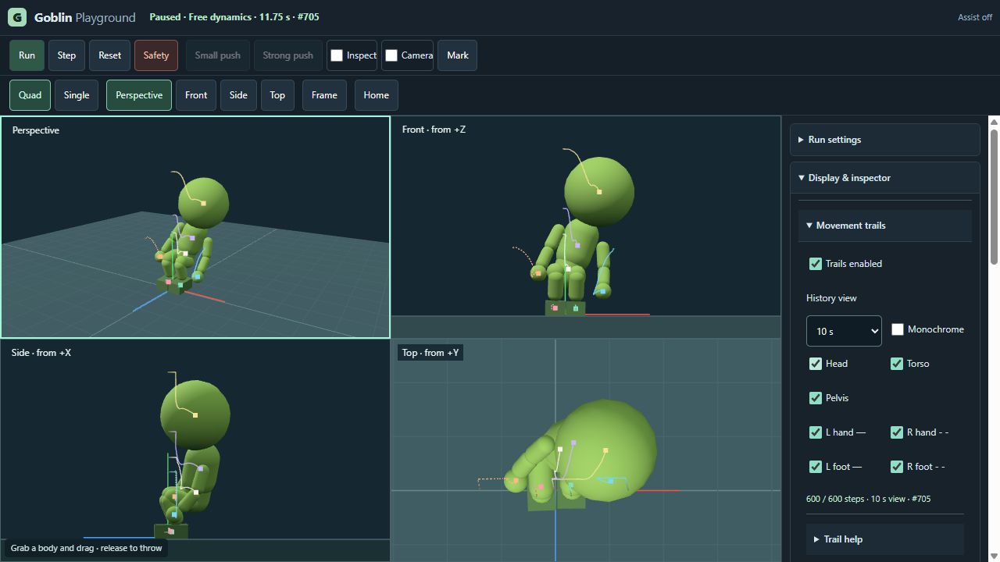
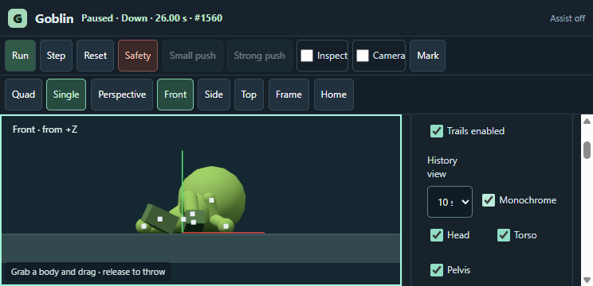
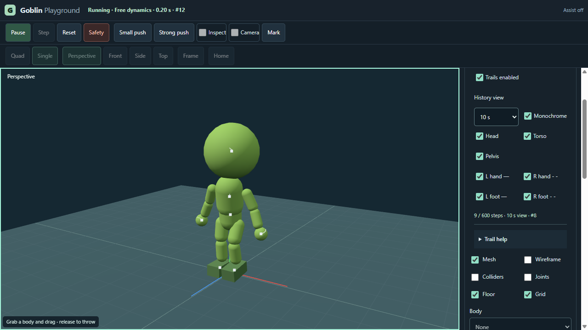

# Playground movement trails (#103)

## Contract

Read-only `RigidBody.translation()` observes the native **body transform origin** in world metres, not mesh bounds or mass centre. IDs are `head`, `torso`, `pelvis`, `handL`, `handR`, `footL`, `footR`; L/R mean the Goblin's anatomical sides. No COM line, measured force or replay promise.

An opt-in observer in `UprightSession.advanceStep()` runs only after the native step counter advances, including a terminal invalid/safety step. All seven bodies share that step and `time_s = step / 60`. One optional labelled initial pose at step 0; no samples from rendering, camera changes, markers, pause or rejected step attempts. The historical route has no observer and retains its recorder policy, clock and controller. No second world, poses, motors or controller parameters are written.

Master OFF unsubscribes and **clears** history. Re-enable at a nonzero step waits for the next executed step, with no backfill. Individual body switches affect visibility only. Reset, variant/world/run changes clear the buffers. Finite terminal poses retain a Safety marker; missing/nonfinite positions store explicit gaps, break line continuity and never upload NaN. Disposal unsubscribes before the native world is freed.

One shared 600-entry ring stores all seven body origins: 109,800 bytes of typed-array storage (600 × [8 step bytes + 7 × (24 position + 1 flag bytes)]). The last 1/3/10 seconds select a simulation-step window, independent of wall time, speed or run length. Overflow drops old entries, never stops simulation. Hidden bodies retain history while the master is ON. Finite initial poses count toward the same 600 limit.

All cameras draw the same world buffers. RGB brightness fades with simulation age; a bright endpoint indicates the newest finite position. Right-hand/foot strokes are dashed, left strokes solid, with explicit L/R labels and a monochrome mode. No animated speed cue. Depth-independent diagnostic lines can appear through the mesh; they are not selectable and do not enter physics picking. GPU buffers are bounded and reused while enabled, freed on OFF/dispose. No post-processing change.

G2, native Hidden/Resume and the late historical state matrix remain separate open evidence. This package proves no new stability, Standing or mobile-hardware performance acceptance.

## Validation and final layout

Baseline `e34679b` (PR #117) had no movement trails. Candidate `55fddb7399de4dd72173e0c14299d23464cb274b` adds this opt-in view; supported Node 24.21.0: **176 tests pass**, standard `npm run build` and `node node_modules/vite/bin/vite.js build --config vite.gameplay.config.js` pass. Seven new regressions cover actual four-step frames, single step, terminal native safety, no phantom steps, exact B/T1/R1 native-state parity, speed/pause/marker timing, 600-ring overflow, 1/3/10 s windows, hidden-body history, explicit nonfinite gaps, shared finite GPU buffers, variant-world replacement and disposal. Controller, rig, grab, fixed clock and archived evidence files are unchanged.

Actual tested production preview: **http://127.0.0.1:4183/goblin/playground/**, build **`06ba58ff64fc4371`**, revision `55fddb7`, dirty **false**. The new local preview runs independently; previous servers and the original dirty user worktree remain intact. Evidence additions do not change the build's hashed runtime inputs.

`tests/trails-browser.cjs --url <above> --executable <confirmed-local-Chrome>` passed in **native Windows Portable Chrome 156.0.8078.4**, own temporary Playwright profile, DPR 1, WebGL2 / ANGLE D3D11 on NVIDIA RTX 3070 Ti. No background-throttling disabling flags. Raw [result](../evidence/issue103/result.json) records launch arguments, build/source hashes and measurements. Body origins and shared world buffers verified in all Quad/Single cameras; keyboard enable, monochrome, full-ring free run, Pause/Step/Reset, marker/JSON, native grab/release, camera gesture, three fresh variants and emulated touch inspection passed, with no new console/network errors. Twelve OFF/reset cycles returned to **18 renderer geometries** each time.

The existing `tests/playground-browser.cjs` with `--issue100 --issue101 --issue102 --issue113` also passed on that exact production build: compact desktop/landscape/portrait layout, all cameras and gesture locks, mouse/emulated-touch picking and grab, overlay parity, marker/export, scheduled inputs, reaction pause/step/resume, Safety/reset, DPR and historical prototype controls. [Regression result](../evidence/issue103/regression.json). Its native tab activation produced no hidden event: **Hidden/Resume NOT PROVEN**, unchanged as an independent open acceptance.

### Bounded cost evidence

180 render samples per case; full 600-entry ring and 10 s drawing window. Foreground native browser only, no concurrent local tests. Each visible body adds one drawcall per view; endpoint dots share one drawcall per view. Seven versus one visible body adds **24** calls in Quad. Absolute totals differ by one between the initial pose and the later settled pose because ordinary meshes can be frustum-culled.

| Viewport / state | Visible bodies | Drawcalls / Quad frame | CPU median / p95 (ms) | Render submit median / p95 (ms) |
|---|---:|---:|---:|---:|
| 1280 × 720 / paused | 1 | 80 | 0.7 / 1.6 | 0.6 / 1.3 |
| 1280 × 720 / paused | 7 | 104 | 1.2 / 2.0 | 1.1 / 1.8 |
| 1280 × 720 / running | 1 | 79 | 1.2 / 2.2 | 0.9 / 1.4 |
| 1280 × 720 / running | 7 | 103 | 1.5 / 2.9 | 0.9 / 1.7 |
| 744 × 360 / paused | 1 | 79 | 1.1 / 2.0 | 1.0 / 1.7 |
| 744 × 360 / paused | 7 | 103 | 1.2 / 2.0 | 1.0 / 1.7 |
| 744 × 360 / running | 1 | 79 | 1.2 / 2.2 | 0.8 / 1.4 |
| 744 × 360 / running | 7 | 103 | 1.4 / 3.1 | 0.9 / 1.5 |

Collector storage is **109,800 bytes**; maximum reused Float32 render-buffer storage is **234,976 bytes**, including endpoints. Both visibility cases retained the seven-line cache because all lines had already been enabled; hidden lines keep their histories and buffers, but are not drawn. OFF disposes all eight owned geometries/materials. These byte counts exclude driver/WASM/material overhead; renderer.info and post-GC JS heap are proxies, not total GPU memory. Observed whole-page JS heap after forced GC ranged **11.98–17.59 MB**, without monotonic growth. Forced-GC CDP round trips were **12.7–29.2 ms**; those include protocol/observer latency and are not isolated GC pause timings. No GPU-time, sustained FPS, phone hardware or long-duration leak claim.

The existing CI/Pages workflows build the standard Arena/Standing distribution. The separate Gameplay/Playground build is checked locally here; publishing that distribution remains the separate #108 package. A green Pages deployment must not be reported as a deployed trail UI. Trail history is intentionally absent from feedback/replay payloads; the existing marked native state and inspector export remain supported.

Next development lever: separately scoped input/selection improvements from the remaining plan, only on a new user instruction. No #104 work or new research is activated by this implementation.
